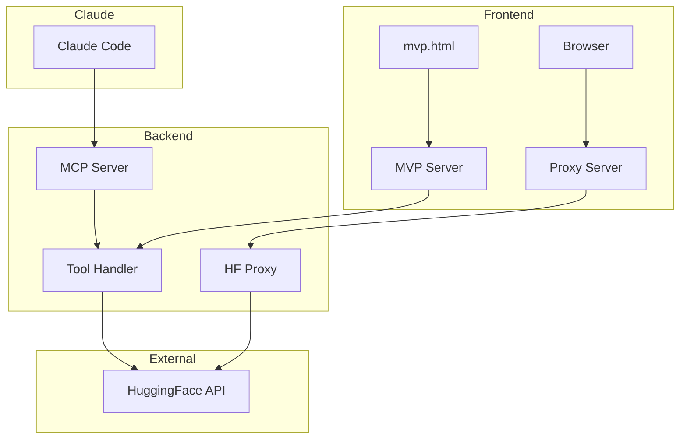
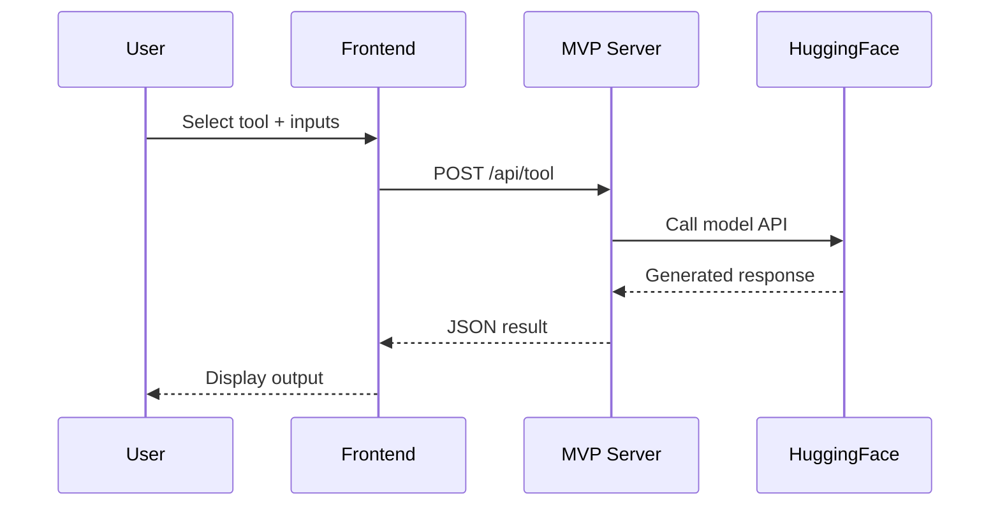

# Algebra 2 Tutor - System Architecture

## Table of Contents
1. [High-Level Overview](#high-level-overview)
2. [Component Diagrams](#component-diagrams)
3. [Data Flow](#data-flow)
4. [MCP Tools Architecture](#mcp-tools-architecture)
5. [MVP Implementation](#mvp-implementation)
6. [File Structure](#file-structure)
7. [API Specifications](#api-specifications)
8. [Deployment Options](#deployment-options)

---

## High-Level Overview

```
┌─────────────────────────────────────────────────────────────────────────────┐
│                        ALGEBRA 2 TUTOR SYSTEM                               │
├─────────────────────────────────────────────────────────────────────────────┤
│                                                                             │
│  ┌─────────────┐    ┌─────────────┐    ┌─────────────┐    ┌─────────────┐  │
│  │   Browser   │    │  MVP Server │    │ MCP Server  │    │ HuggingFace │  │
│  │  Frontend   │───▶│  (HTTP)     │───▶│  (stdio)    │───▶│    API      │  │
│  │             │    │  port:3000  │    │             │    │             │  │
│  └─────────────┘    └─────────────┘    └─────────────┘    └─────────────┘  │
│        │                                      │                             │
│        │            ┌─────────────┐           │                             │
│        └───────────▶│ Claude Code │◀──────────┘                             │
│                     │   (CLI)     │                                         │
│                     └─────────────┘                                         │
│                                                                             │
└─────────────────────────────────────────────────────────────────────────────┘
```

### Three Access Methods

| Method | Use Case | Protocol |
|--------|----------|----------|
| **Browser + MVP Server** | Web UI testing | HTTP REST |
| **Claude Code + MCP** | AI-powered CLI | MCP (stdio) |
| **Direct Proxy** | Legacy frontend | HTTP REST |

---

## Component Diagrams

### 1. Frontend Components

```
┌─────────────────────────────────────────────────────────────────────────────┐
│                              FRONTEND LAYER                                 │
├─────────────────────────────────────────────────────────────────────────────┤
│                                                                             │
│  ┌──────────────────┐  ┌──────────────────┐  ┌──────────────────┐          │
│  │    index.html    │  │   session.html   │  │    upload.html   │          │
│  │  (Landing Page)  │  │ (Practice Mode)  │  │  (PDF Upload)    │          │
│  └────────┬─────────┘  └────────┬─────────┘  └────────┬─────────┘          │
│           │                     │                     │                     │
│           ▼                     ▼                     ▼                     │
│  ┌──────────────────────────────────────────────────────────────┐          │
│  │                     JavaScript Modules                        │          │
│  ├──────────────────────────────────────────────────────────────┤          │
│  │  ┌─────────────┐  ┌─────────────┐  ┌─────────────┐           │          │
│  │  │  core.js    │  │   quiz.js   │  │  lessons.js │           │          │
│  │  │ (Utilities) │  │ (Questions) │  │ (Curriculum)│           │          │
│  │  └─────────────┘  └─────────────┘  └─────────────┘           │          │
│  │  ┌─────────────┐  ┌─────────────┐  ┌─────────────┐           │          │
│  │  │ai-service.js│  │rag-engine.js│  │session-mgr.js│          │          │
│  │  │ (HF API)    │  │ (Retrieval) │  │ (Adaptive)  │           │          │
│  │  └─────────────┘  └─────────────┘  └─────────────┘           │          │
│  │  ┌─────────────┐  ┌─────────────┐                            │          │
│  │  │pdf-processor│  │firebase-cfg │                            │          │
│  │  │ (PDF.js)    │  │ (Storage)   │                            │          │
│  │  └─────────────┘  └─────────────┘                            │          │
│  └──────────────────────────────────────────────────────────────┘          │
│                                                                             │
│  ┌──────────────────┐                                                       │
│  │     mvp.html     │◀─── NEW: Simple test UI for MCP tools                │
│  │  (Tool Tester)   │                                                       │
│  └──────────────────┘                                                       │
│                                                                             │
└─────────────────────────────────────────────────────────────────────────────┘
```

### 2. Backend Components

```
┌─────────────────────────────────────────────────────────────────────────────┐
│                              BACKEND LAYER                                  │
├─────────────────────────────────────────────────────────────────────────────┤
│                                                                             │
│  ┌─────────────────────────────────────────────────────────────────────┐   │
│  │                         SERVER OPTIONS                               │   │
│  ├─────────────────────────────────────────────────────────────────────┤   │
│  │                                                                       │   │
│  │  Option A: MVP Server (Simple HTTP)                                  │   │
│  │  ┌─────────────────────────────────────────────────────────────┐    │   │
│  │  │  mvp-server.js                                               │    │   │
│  │  │  ├── GET  /           → Serve mvp.html                       │    │   │
│  │  │  └── POST /api/tool   → Execute MCP tool                     │    │   │
│  │  │       Body: { tool: string, args: object }                   │    │   │
│  │  │       Response: { result: any } | { error: string }          │    │   │
│  │  └─────────────────────────────────────────────────────────────┘    │   │
│  │                                                                       │   │
│  │  Option B: MCP Server (Claude Code Integration)                      │   │
│  │  ┌─────────────────────────────────────────────────────────────┐    │   │
│  │  │  mcp-server/server.js                                        │    │   │
│  │  │  ├── Transport: stdio (stdin/stdout)                         │    │   │
│  │  │  ├── Protocol: MCP (Model Context Protocol)                  │    │   │
│  │  │  └── Tools: generate_question, generate_embedding,           │    │   │
│  │  │             explain_mistake                                  │    │   │
│  │  └─────────────────────────────────────────────────────────────┘    │   │
│  │                                                                       │   │
│  │  Option C: Proxy Server (Legacy)                                     │   │
│  │  ┌─────────────────────────────────────────────────────────────┐    │   │
│  │  │  proxy-server.js                                             │    │   │
│  │  │  └── POST /api/inference → Forward to HuggingFace            │    │   │
│  │  └─────────────────────────────────────────────────────────────┘    │   │
│  │                                                                       │   │
│  └─────────────────────────────────────────────────────────────────────┘   │
│                                                                             │
└─────────────────────────────────────────────────────────────────────────────┘
```

### 3. External Services

```
┌─────────────────────────────────────────────────────────────────────────────┐
│                           EXTERNAL SERVICES                                 │
├─────────────────────────────────────────────────────────────────────────────┤
│                                                                             │
│  ┌───────────────────────────────────────────────────────────────────────┐ │
│  │                        HUGGINGFACE INFERENCE API                       │ │
│  │                                                                         │ │
│  │  Base URL: https://router.huggingface.co/hf-inference/models/          │ │
│  │                                                                         │ │
│  │  ┌─────────────────────────────┐  ┌─────────────────────────────────┐ │ │
│  │  │  Qwen/Qwen2.5-Math-72B     │  │  sentence-transformers/         │ │ │
│  │  │  -Instruct                  │  │  all-MiniLM-L6-v2               │ │ │
│  │  │                             │  │                                  │ │ │
│  │  │  Purpose:                   │  │  Purpose:                        │ │ │
│  │  │  • Question generation      │  │  • Text embeddings               │ │ │
│  │  │  • Mistake explanations     │  │  • Semantic search               │ │ │
│  │  │  • Step-by-step solutions   │  │  • RAG retrieval                 │ │ │
│  │  │                             │  │                                  │ │ │
│  │  │  Output: Text               │  │  Output: 384-dim vector          │ │ │
│  │  └─────────────────────────────┘  └─────────────────────────────────┘ │ │
│  └───────────────────────────────────────────────────────────────────────┘ │
│                                                                             │
│  ┌───────────────────────────────────────────────────────────────────────┐ │
│  │                        FIREBASE (OPTIONAL)                             │ │
│  │  ┌─────────────────┐  ┌─────────────────┐  ┌─────────────────┐       │ │
│  │  │   Firestore     │  │    Storage      │  │      Auth       │       │ │
│  │  │  (Documents)    │  │   (PDF Files)   │  │    (Users)      │       │ │
│  │  └─────────────────┘  └─────────────────┘  └─────────────────┘       │ │
│  └───────────────────────────────────────────────────────────────────────┘ │
│                                                                             │
└─────────────────────────────────────────────────────────────────────────────┘
```

---

## Data Flow

### Question Generation Flow

```
┌──────────┐     ┌──────────┐     ┌──────────┐     ┌──────────┐     ┌──────────┐
│  User    │     │ Frontend │     │  Server  │     │    HF    │     │  Result  │
│  Input   │     │  (MVP)   │     │  (Node)  │     │   API    │     │          │
└────┬─────┘     └────┬─────┘     └────┬─────┘     └────┬─────┘     └────┬─────┘
     │                │                │                │                │
     │ 1. Select      │                │                │                │
     │    topic +     │                │                │                │
     │    difficulty  │                │                │                │
     │───────────────▶│                │                │                │
     │                │                │                │                │
     │                │ 2. POST        │                │                │
     │                │    /api/tool   │                │                │
     │                │    {tool:      │                │                │
     │                │     "generate_ │                │                │
     │                │     question"} │                │                │
     │                │───────────────▶│                │                │
     │                │                │                │                │
     │                │                │ 3. Build       │                │
     │                │                │    prompt +    │                │
     │                │                │    call HF     │                │
     │                │                │───────────────▶│                │
     │                │                │                │                │
     │                │                │                │ 4. Generate    │
     │                │                │                │    question    │
     │                │                │                │    with LLM    │
     │                │                │                │───────────────▶│
     │                │                │                │                │
     │                │                │◀───────────────│                │
     │                │                │  5. Response   │                │
     │                │◀───────────────│                │                │
     │                │  6. JSON       │                │                │
     │◀───────────────│                │                │                │
     │  7. Display    │                │                │                │
     │     question   │                │                │                │
     │                │                │                │                │
```

### Embedding Generation Flow

```
┌────────────────────────────────────────────────────────────────────────────┐
│                        EMBEDDING PIPELINE                                   │
├────────────────────────────────────────────────────────────────────────────┤
│                                                                             │
│   Input Text                    Processing                      Output      │
│   ──────────                    ──────────                      ──────      │
│                                                                             │
│   "Factor the                                                               │
│    polynomial        ───▶    ┌─────────────┐    ───▶    [0.023, -0.156,    │
│    x² + 5x + 6"              │ MiniLM-L6   │            0.089, ...,        │
│                              │ (384 dims)  │            0.042]             │
│                              └─────────────┘            (384 floats)       │
│                                                                             │
│   Use Cases:                                                                │
│   ──────────                                                                │
│   • Store in vector DB (Pinecone, Chroma)                                  │
│   • Find similar content via cosine similarity                              │
│   • Power RAG retrieval for contextual questions                           │
│                                                                             │
└────────────────────────────────────────────────────────────────────────────┘
```

### Mistake Explanation Flow

```
┌────────────────────────────────────────────────────────────────────────────┐
│                     MISTAKE EXPLANATION PIPELINE                            │
├────────────────────────────────────────────────────────────────────────────┤
│                                                                             │
│   INPUTS                                                                    │
│   ┌─────────────────────────────────────────────────────────────────────┐  │
│   │  question: "What is (x+2)(x+3)?"                                    │  │
│   │  wrongAnswer: "x² + 5x + 5"                                         │  │
│   │  correctAnswer: "x² + 5x + 6"                                       │  │
│   └─────────────────────────────────────────────────────────────────────┘  │
│                              │                                              │
│                              ▼                                              │
│   ┌─────────────────────────────────────────────────────────────────────┐  │
│   │                    QWEN-MATH MODEL                                   │  │
│   │                                                                       │  │
│   │  Prompt: "Question: {question}                                       │  │
│   │          Student's answer: {wrongAnswer}                             │  │
│   │          Correct answer: {correctAnswer}                             │  │
│   │                                                                       │  │
│   │          Explain why the student's answer is wrong..."               │  │
│   └─────────────────────────────────────────────────────────────────────┘  │
│                              │                                              │
│                              ▼                                              │
│   OUTPUT                                                                    │
│   ┌─────────────────────────────────────────────────────────────────────┐  │
│   │  "Great effort! You're very close. Let's look at where the          │  │
│   │   calculation went slightly off:                                     │  │
│   │                                                                       │  │
│   │   When multiplying (x+2)(x+3), we use FOIL:                          │  │
│   │   • First: x × x = x²                                                │  │
│   │   • Outer: x × 3 = 3x                                                │  │
│   │   • Inner: 2 × x = 2x                                                │  │
│   │   • Last: 2 × 3 = 6  ← You wrote 5 here                              │  │
│   │                                                                       │  │
│   │   So the correct answer is x² + 5x + 6"                              │  │
│   └─────────────────────────────────────────────────────────────────────┘  │
│                                                                             │
└────────────────────────────────────────────────────────────────────────────┘
```

---

## MCP Tools Architecture

### Tool Specifications

```
┌────────────────────────────────────────────────────────────────────────────┐
│                          MCP TOOLS (3 Total)                                │
├────────────────────────────────────────────────────────────────────────────┤
│                                                                             │
│  ┌────────────────────────────────────────────────────────────────────┐    │
│  │  TOOL 1: generate_question                                          │    │
│  ├────────────────────────────────────────────────────────────────────┤    │
│  │  Input Schema:                                                       │    │
│  │  {                                                                   │    │
│  │    "topic": string,      // e.g., "polynomials", "factoring"        │    │
│  │    "difficulty": number  // 1-4 scale                               │    │
│  │  }                                                                   │    │
│  │                                                                       │    │
│  │  Output Format:                                                       │    │
│  │  QUESTION: [question text]                                           │    │
│  │  A) [option A]                                                        │    │
│  │  B) [option B]                                                        │    │
│  │  C) [option C]                                                        │    │
│  │  D) [option D]                                                        │    │
│  │  CORRECT: [A/B/C/D]                                                   │    │
│  │  SOLUTION: [step-by-step]                                            │    │
│  │                                                                       │    │
│  │  Model: Qwen/Qwen2.5-Math-72B-Instruct                               │    │
│  │  Params: max_tokens=500, temperature=0.7                              │    │
│  └────────────────────────────────────────────────────────────────────┘    │
│                                                                             │
│  ┌────────────────────────────────────────────────────────────────────┐    │
│  │  TOOL 2: generate_embedding                                          │    │
│  ├────────────────────────────────────────────────────────────────────┤    │
│  │  Input Schema:                                                       │    │
│  │  {                                                                   │    │
│  │    "text": string  // Text to embed (max ~10k chars)                │    │
│  │  }                                                                   │    │
│  │                                                                       │    │
│  │  Output Format:                                                       │    │
│  │  {                                                                   │    │
│  │    "embedding": number[],  // 384-dimensional vector                 │    │
│  │    "dimensions": 384                                                  │    │
│  │  }                                                                   │    │
│  │                                                                       │    │
│  │  Model: sentence-transformers/all-MiniLM-L6-v2                       │    │
│  │  Use: RAG, semantic search, similarity matching                      │    │
│  └────────────────────────────────────────────────────────────────────┘    │
│                                                                             │
│  ┌────────────────────────────────────────────────────────────────────┐    │
│  │  TOOL 3: explain_mistake                                             │    │
│  ├────────────────────────────────────────────────────────────────────┤    │
│  │  Input Schema:                                                       │    │
│  │  {                                                                   │    │
│  │    "question": string,      // The math question                     │    │
│  │    "wrongAnswer": string,   // Student's incorrect answer            │    │
│  │    "correctAnswer": string  // The correct answer                    │    │
│  │  }                                                                   │    │
│  │                                                                       │    │
│  │  Output: Educational explanation (encouraging tone)                   │    │
│  │                                                                       │    │
│  │  Model: Qwen/Qwen2.5-Math-72B-Instruct                               │    │
│  │  Params: max_tokens=300, temperature=0.5                              │    │
│  └────────────────────────────────────────────────────────────────────┘    │
│                                                                             │
└────────────────────────────────────────────────────────────────────────────┘
```

### MCP Protocol Flow

```
┌────────────────────────────────────────────────────────────────────────────┐
│                         MCP COMMUNICATION                                   │
├────────────────────────────────────────────────────────────────────────────┤
│                                                                             │
│  Claude Code                    MCP Server                   HuggingFace   │
│  ───────────                    ──────────                   ───────────   │
│       │                              │                             │        │
│       │  1. ListTools               │                             │        │
│       │─────────────────────────────▶                             │        │
│       │                              │                             │        │
│       │  2. Tools: [generate_question,                            │        │
│       │            generate_embedding,                            │        │
│       │            explain_mistake]  │                             │        │
│       │◀─────────────────────────────│                             │        │
│       │                              │                             │        │
│       │  3. CallTool:               │                             │        │
│       │     generate_question       │                             │        │
│       │     {topic: "factoring",    │                             │        │
│       │      difficulty: 2}         │                             │        │
│       │─────────────────────────────▶                             │        │
│       │                              │                             │        │
│       │                              │  4. POST /models/Qwen...   │        │
│       │                              │─────────────────────────────▶        │
│       │                              │                             │        │
│       │                              │  5. Generated text         │        │
│       │                              │◀─────────────────────────────        │
│       │                              │                             │        │
│       │  6. Result:                 │                             │        │
│       │     {content: [{type: "text",                             │        │
│       │      text: "QUESTION:..."}]}│                             │        │
│       │◀─────────────────────────────│                             │        │
│       │                              │                             │        │
│                                                                             │
│  Transport: stdio (stdin/stdout JSON-RPC)                                  │
│  Protocol: MCP (Model Context Protocol)                                     │
│                                                                             │
└────────────────────────────────────────────────────────────────────────────┘
```

---

## MVP Implementation

### Architecture

```
┌────────────────────────────────────────────────────────────────────────────┐
│                         MVP ARCHITECTURE                                    │
├────────────────────────────────────────────────────────────────────────────┤
│                                                                             │
│  ┌──────────────────────────────────────────────────────────────────────┐  │
│  │                        mvp.html (Browser)                             │  │
│  │                                                                        │  │
│  │  ┌─────────────────┐ ┌─────────────────┐ ┌─────────────────┐         │  │
│  │  │ Tab: Generate   │ │ Tab: Generate   │ │ Tab: Explain    │         │  │
│  │  │     Question    │ │    Embedding    │ │    Mistake      │         │  │
│  │  └────────┬────────┘ └────────┬────────┘ └────────┬────────┘         │  │
│  │           │                   │                   │                   │  │
│  │           └───────────────────┼───────────────────┘                   │  │
│  │                               │                                       │  │
│  │                               ▼                                       │  │
│  │                    ┌─────────────────────┐                            │  │
│  │                    │   callTool(name,    │                            │  │
│  │                    │              args)  │                            │  │
│  │                    └──────────┬──────────┘                            │  │
│  └───────────────────────────────┼──────────────────────────────────────┘  │
│                                  │                                          │
│                                  │ POST /api/tool                          │
│                                  │ {tool: "...", args: {...}}              │
│                                  ▼                                          │
│  ┌──────────────────────────────────────────────────────────────────────┐  │
│  │                      mvp-server.js (Node.js)                          │  │
│  │                                                                        │  │
│  │  const tools = {                                                       │  │
│  │    generate_question: async ({topic, difficulty}) => {...},           │  │
│  │    generate_embedding: async ({text}) => {...},                       │  │
│  │    explain_mistake: async ({question, wrongAnswer, correctAnswer})    │  │
│  │  }                                                                     │  │
│  │                                                                        │  │
│  │  Routes:                                                               │  │
│  │  ├── GET  /         → Serve mvp.html                                  │  │
│  │  └── POST /api/tool → Execute tool, return result                     │  │
│  └──────────────────────────────────────────────────────────────────────┘  │
│                                  │                                          │
│                                  │ fetch() to HuggingFace                  │
│                                  ▼                                          │
│  ┌──────────────────────────────────────────────────────────────────────┐  │
│  │                     HuggingFace Inference API                         │  │
│  └──────────────────────────────────────────────────────────────────────┘  │
│                                                                             │
└────────────────────────────────────────────────────────────────────────────┘
```

### Quick Start

```bash
# Terminal 1: Start MVP server
HF_API_KEY=hf_xxx node mvp-server.js

# Terminal 2: Open browser
open http://localhost:3000
```

---

## File Structure

```
Algebra-2/
├── 📄 index.html              # Landing page (mode selection)
├── 📄 session.html            # AI practice session
├── 📄 upload.html             # PDF upload interface
├── 📄 lessons.html            # Classic guided lessons
├── 📄 mvp.html                # NEW: Simple tool tester UI
├── 📄 test.html               # Unit tests
│
├── 📁 js/
│   ├── 📄 core.js             # Shared utilities
│   ├── 📄 quiz.js             # Question handling
│   ├── 📄 lessons.js          # Lesson content
│   ├── 📄 app.js              # Main app logic
│   ├── 📄 ai-service.js       # HuggingFace API wrapper
│   ├── 📄 rag-engine.js       # RAG pipeline
│   ├── 📄 pdf-processor.js    # PDF extraction
│   ├── 📄 session-manager.js  # Adaptive sessions
│   ├── 📄 firebase-config.js  # Firebase setup
│   └── 📄 logger.js           # Logging utilities
│
├── 📁 css/
│   └── 📄 style.css           # Styles
│
├── 📁 mcp-server/             # MCP Server (Claude Code)
│   ├── 📄 server.js           # Main MCP server (213 lines)
│   ├── 📄 package.json        # Dependencies
│   ├── 📄 .env.example        # Environment template
│   └── 📄 README.md           # Server docs
│
├── 📄 mvp-server.js           # NEW: HTTP wrapper for testing
├── 📄 proxy-server.js         # Legacy HF proxy
│
├── 📁 docs/
│   ├── 📄 ARCHITECTURE.md     # THIS FILE
│   ├── 📄 MCP_IMPLEMENTATION_GUIDE.md
│   ├── 📄 MCP_SUMMARY.md
│   ├── 📄 PROJECT_SUMMARY.md
│   ├── 📄 SETUP.md
│   └── 📄 QUICKSTART.md
│
└── 📄 README.md               # Project overview
```

---

## API Specifications

### MVP Server API

```
┌────────────────────────────────────────────────────────────────────────────┐
│                        MVP SERVER API                                       │
├────────────────────────────────────────────────────────────────────────────┤
│                                                                             │
│  Base URL: http://localhost:3000                                           │
│                                                                             │
│  ┌────────────────────────────────────────────────────────────────────┐    │
│  │  GET /                                                               │    │
│  │  ─────                                                               │    │
│  │  Response: mvp.html (HTML page)                                      │    │
│  └────────────────────────────────────────────────────────────────────┘    │
│                                                                             │
│  ┌────────────────────────────────────────────────────────────────────┐    │
│  │  POST /api/tool                                                      │    │
│  │  ──────────────                                                      │    │
│  │  Request Body:                                                        │    │
│  │  {                                                                    │    │
│  │    "tool": "generate_question" | "generate_embedding" |              │    │
│  │            "explain_mistake",                                         │    │
│  │    "args": {                                                          │    │
│  │      // Tool-specific arguments                                       │    │
│  │    }                                                                  │    │
│  │  }                                                                    │    │
│  │                                                                       │    │
│  │  Success Response (200):                                              │    │
│  │  {                                                                    │    │
│  │    "result": <tool output>                                            │    │
│  │  }                                                                    │    │
│  │                                                                       │    │
│  │  Error Response (400/500):                                            │    │
│  │  {                                                                    │    │
│  │    "error": "Error message"                                           │    │
│  │  }                                                                    │    │
│  └────────────────────────────────────────────────────────────────────┘    │
│                                                                             │
└────────────────────────────────────────────────────────────────────────────┘
```

### Example Requests

```bash
# Generate Question
curl -X POST http://localhost:3000/api/tool \
  -H "Content-Type: application/json" \
  -d '{
    "tool": "generate_question",
    "args": {"topic": "factoring", "difficulty": 2}
  }'

# Generate Embedding
curl -X POST http://localhost:3000/api/tool \
  -H "Content-Type: application/json" \
  -d '{
    "tool": "generate_embedding",
    "args": {"text": "Factor x² + 5x + 6"}
  }'

# Explain Mistake
curl -X POST http://localhost:3000/api/tool \
  -H "Content-Type: application/json" \
  -d '{
    "tool": "explain_mistake",
    "args": {
      "question": "What is (x+2)(x+3)?",
      "wrongAnswer": "x² + 5x + 5",
      "correctAnswer": "x² + 5x + 6"
    }
  }'
```

---

## Deployment Options

```
┌────────────────────────────────────────────────────────────────────────────┐
│                        DEPLOYMENT OPTIONS                                   │
├────────────────────────────────────────────────────────────────────────────┤
│                                                                             │
│  Option 1: Local Development                                                │
│  ────────────────────────────                                               │
│  ┌─────────────────────────────────────────────────────────────────────┐   │
│  │  # Start MVP server                                                  │   │
│  │  HF_API_KEY=hf_xxx node mvp-server.js                               │   │
│  │                                                                       │   │
│  │  # Or start MCP server for Claude Code                               │   │
│  │  HF_API_KEY=hf_xxx node mcp-server/server.js                        │   │
│  └─────────────────────────────────────────────────────────────────────┘   │
│                                                                             │
│  Option 2: Claude Code Integration                                          │
│  ─────────────────────────────────                                          │
│  ┌─────────────────────────────────────────────────────────────────────┐   │
│  │  Edit ~/.claude/mcp.json:                                            │   │
│  │  {                                                                    │   │
│  │    "mcpServers": {                                                    │   │
│  │      "algebra-tutor": {                                               │   │
│  │        "command": "node",                                             │   │
│  │        "args": ["/path/to/mcp-server/server.js"],                    │   │
│  │        "env": {"HF_API_KEY": "hf_xxx"}                               │   │
│  │      }                                                                │   │
│  │    }                                                                  │   │
│  │  }                                                                    │   │
│  └─────────────────────────────────────────────────────────────────────┘   │
│                                                                             │
│  Option 3: GitHub Pages (Frontend Only)                                     │
│  ──────────────────────────────────────                                     │
│  ┌─────────────────────────────────────────────────────────────────────┐   │
│  │  • Push to GitHub                                                     │   │
│  │  • Enable GitHub Pages                                                │   │
│  │  • Frontend works, but needs proxy for API calls                     │   │
│  │  • Use existing proxy-server.js on a VPS/Cloud Run                   │   │
│  └─────────────────────────────────────────────────────────────────────┘   │
│                                                                             │
│  Option 4: Docker (Future)                                                  │
│  ─────────────────────────                                                  │
│  ┌─────────────────────────────────────────────────────────────────────┐   │
│  │  docker-compose up -d                                                 │   │
│  │                                                                       │   │
│  │  Services:                                                            │   │
│  │  • mvp-server (port 3000)                                            │   │
│  │  • mcp-server (stdio)                                                │   │
│  └─────────────────────────────────────────────────────────────────────┘   │
│                                                                             │
└────────────────────────────────────────────────────────────────────────────┘
```

---

## Mermaid Diagrams

### System Overview (for GitHub rendering)



### Tool Flow



---

## Summary

| Component | Purpose | Port/Protocol |
|-----------|---------|---------------|
| `mvp.html` | Browser UI for testing tools | - |
| `mvp-server.js` | HTTP server wrapping MCP tools | 3000 / HTTP |
| `mcp-server/server.js` | MCP server for Claude Code | stdio / MCP |
| `proxy-server.js` | Legacy HF proxy | 8787 / HTTP |
| HuggingFace API | AI model inference | HTTPS |

**Quick Start:**
```bash
HF_API_KEY=your_key node mvp-server.js
open http://localhost:3000
```
